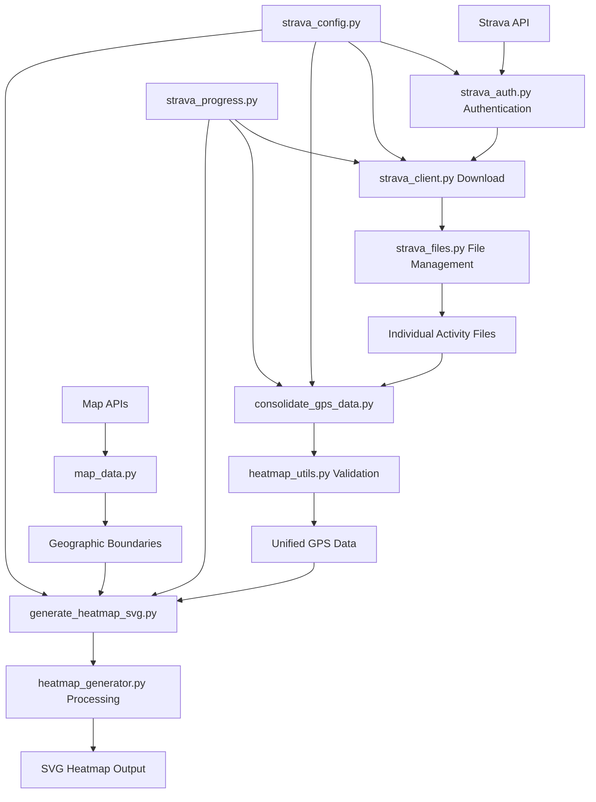

# CLAUDE.md

This file provides guidance to Claude Code (claude.ai/code) when working with code in this repository.

## Project Overview

This is a professional-grade Python application that downloads GPS data from Strava and generates high-quality SVG heatmaps with advanced regional filtering capabilities. The application has been extensively refactored (2025-07-01) and enhanced with regional filtering features (2025-07-02) to use modular utilities, centralized configuration, and robust error handling. It consists of main scripts supported by specialized utility modules.

**Key Features:**
- Regional GPS filtering (Japan, USA, Minnesota, Saint Paul 100km radius)
- Multi-layer geographic boundary rendering (prefectures, states, lakes)
- Minnesota state parks visualization (59 parks with individual control)
- US National Parks visualization (79 parks with triangle markers)
- US Cities visualization (10 cities with square markers)
- Unified visual design (1600x1600 pixels, 2.0 width GPS tracks)
- Automatic boundary optimization for performance
- PNG export capabilities for documentation
- Maine state boundary rendering (fixed 2025-07-08)

## Common Commands

### Environment Setup
```bash
# Create virtual environment
python3 -m venv venv
source venv/bin/activate

# Install dependencies
pip install -r requirements.txt
```

**IMPORTANT**: Always use the Python virtual environment (`venv`) when running any Python scripts in this project. All commands should be prefixed with `source venv/bin/activate &&` or run after activating the virtual environment to ensure proper dependency isolation.

### Data Download
```bash
# Primary download method (recommended)
source venv/bin/activate && python download_strava_data.py

# Alternative: Individual activity download
source venv/bin/activate && python download_individual_activities.py
```
- Downloads GPS data from Strava API using centralized utilities
- Creates `config.json` on first run (needs manual configuration)
- Automatically handles token refresh and rate limiting via `strava_auth.py`
- Uses `strava_files.py` for consistent file management
- Saves data to `strava_data/` directory with progress reporting

### Data Consolidation
```bash
source venv/bin/activate && python consolidate_gps_data.py
```
- Consolidates individual activity files into unified GPS dataset
- Uses `heatmap_utils.py` for data validation and summary
- Creates timestamped and latest versions automatically

### Heatmap Generation
```bash
# Generate heatmap for all GPS data (default)
source venv/bin/activate && python generate_heatmap_svg.py

# Generate regional heatmaps
source venv/bin/activate && python generate_heatmap_svg.py --region japan
source venv/bin/activate && python generate_heatmap_svg.py --region usa  
source venv/bin/activate && python generate_heatmap_svg.py --region minnesota
source venv/bin/activate && python generate_heatmap_svg.py --region saint_paul_100km
```
- Generates SVG heatmap from consolidated data
- Uses `heatmap_utils.py` for optimization and validation
- Creates region-specific output files (e.g., `strava_heatmap_japan.svg`)
- Automatic geographic filtering based on coordinate bounds
- Region-specific boundary data loading
- **UTM Zone 15N projection** for Minnesota and Saint Paul regions (high accuracy)

### Utilities and Development
```bash
# Check rate limit status
source venv/bin/activate && python check_rate_limit.py

# Get new tokens with OAuth flow
source venv/bin/activate && python get_new_token.py

# Background download with resume capability
source venv/bin/activate && python background_download.py
```

### PNG Export for Documentation
```bash
# Convert SVG heatmaps to PNG for documentation (requires rsvg-convert)
rsvg-convert -w 800 -h 800 -f png -o strava_heatmap_minnesota.png strava_heatmap_minnesota.svg
rsvg-convert -w 800 -h 800 -f png -o strava_heatmap_japan.png strava_heatmap_japan.svg
rsvg-convert -w 800 -h 800 -f png -o strava_heatmap_usa.png strava_heatmap_usa.svg
```
- Install with: `brew install librsvg` (macOS) or `apt-get install librsvg2-bin` (Ubuntu)
- Alternative: ImageMagick `magick convert` command

## Refactored Architecture (2025-07-01)

### 🚀 Main Application Scripts

**Entry Points:**
- `download_strava_data.py`: Main download script (108 lines, 47% reduction from refactoring)
- `download_individual_activities.py`: Individual activity download (117 lines, 46% reduction)
- `consolidate_gps_data.py`: Data consolidation with validation (141 lines, enhanced functionality)
- `generate_heatmap_svg.py`: Heatmap generation with validation (230 lines, enhanced with error handling)

**Supporting Scripts:**
- `background_download.py`: Long-running download with resume capability
- `check_rate_limit.py`: Real-time API rate limit monitoring
- `get_new_token.py`: OAuth token acquisition helper

### 🔧 Strava Utility Modules (New Architecture)

**`strava_config.py` (251 lines):**
- Centralized configuration management with validation
- Automatic default config generation
- Type-safe configuration access with dot notation
- Configuration validation and error reporting
- Token management integration

**`strava_auth.py` (242 lines):**
- Unified authentication and rate limiting
- Automatic token refresh and persistence
- Rate limit detection and waiting with progress display
- Keyboard-interruptible waiting (1-second chunks)
- Integration with `strava_config.py` for credential management

**`strava_files.py` (360 lines):**
- Standardized file operations across all scripts
- Automatic timestamp and latest file generation
- Safe filename generation (handles Unicode activity names)
- Individual activity file loading and consolidation
- Consistent JSON file handling with error recovery

**`strava_progress.py` (343 lines):**
- Unified progress reporting and statistics
- Real-time activity processing logs
- Performance metrics and ETA estimation
- Standardized summary reports
- Rate limit usage tracking

**`strava_utils.py` (428 lines):**
- Common helper functions and data validation
- Activity type filtering and GPS data validation
- Error handling utilities and keyboard interrupt management
- Filename sanitization and date extraction
- Python version checking and environment validation

### 🗺️ Heatmap Core Modules

**`heatmap_generator.py`:**
- Bresenham line algorithm for GPS track rendering
- Configurable grid resolution and bounds calculation
- Efficient coordinate transformation and mapping

**`heatmap_utils.py` (311 lines, new):**
- GPS data structure validation and integrity checking
- Geographic bounds calculation and filtering
- Heatmap resolution optimization based on data density
- Processing time estimation and performance metrics
- Configuration validation for heatmap-specific settings

**`map_data.py` (Enhanced with detailed boundaries):**
- Multi-source geographic boundary data download and caching
- Hierarchical boundary system: world, prefectures/states, cities, lakes
- Automatic region detection (Japan, USA, Minnesota)
- Geographic intersection filtering based on GPS bounds
- Robust fallback mechanisms for data source failures
- Local caching system for offline operation (`map_cache/` directory)
- Support for GeoJSON boundary data processing

**`svg_renderer.py` (Enhanced with UTM projection):**
- **Dual projection system**: Equirectangular (default) and UTM Zone 15N (Minnesota regions)
- **Automatic projection selection**: UTM for high-accuracy Minnesota/Saint Paul visualization
- **PyProj integration**: Professional coordinate transformation using EPSG:32615
- **Geographic coordinate transformation**: Lat/lon to optimized SVG space
- **Boundary path rendering**: Multi-layer geographic boundaries with GPS track visualization
- **Distance-accurate rendering**: <0.04% error for UTM regions
- Title and legend generation

### 🔗 Strava Integration

**`strava_client.py`:**
- Strava API client with automatic token management
- Integrated rate limiting with `StravaRateLimiter` class
- Individual activity download and GPS data extraction
- Robust error handling for 401/429 responses

## Data Flow and Processing Pipeline

### Enhanced Data Pipeline (Post-Refactoring)



### Processing Steps

1. **Configuration**: `strava_config.py` loads and validates settings
2. **Authentication**: `strava_auth.py` handles OAuth flow and rate limiting
3. **Download**: Main scripts use `strava_client.py` with utilities
4. **File Management**: `strava_files.py` handles all file operations
5. **Progress Tracking**: `strava_progress.py` provides real-time feedback
6. **Data Validation**: `heatmap_utils.py` ensures data integrity
7. **Heatmap Generation**: Core modules generate final SVG output

## Configuration Management

### Centralized Configuration via `strava_config.py`

**Complete config.json structure:**
```json
{
  "strava": {
    "client_id": "YOUR_CLIENT_ID",
    "client_secret": "YOUR_CLIENT_SECRET", 
    "access_token": "YOUR_ACCESS_TOKEN",
    "refresh_token": "YOUR_REFRESH_TOKEN"
  },
  "data": {
    "output_dir": "strava_data",
    "input_dir": "strava_data",
    "gps_data_file": "gps_data.json"
  },
  "output": {
    "filename": "strava_heatmap.svg",
    "width": 12000,
    "height": 8000
  },
  "style": {
    "background_color": "#ffffff",
    "track_color": "#ff0000",
    "track_width": "1.0",
    "track_opacity": "0.7",
    "boundary_color": "#000000",
    "boundary_width": "0.8",
    "boundary_fill": "none"
  },
  "boundaries": {
    "world": {
      "enabled": true,
      "color": "#000000",
      "width": "1.0"
    },
    "japan": {
      "enabled": true,
      "coastline": {
        "enabled": true,
        "color": "#000000",
        "width": "0.8"
      },
      "prefectures": {
        "enabled": true,
        "color": "#666666",
        "width": "0.5"
      },
      "lakes": {
        "enabled": true,
        "color": "#000000",
        "width": "0.3"
      }
    },
    "usa": {
      "enabled": true,
      "coastline": {
        "enabled": true,
        "color": "#000000",
        "width": "0.8"
      },
      "states": {
        "enabled": true,
        "color": "#666666",
        "width": "0.5"
      },
      "lakes": {
        "enabled": true,
        "color": "#000000",
        "width": "0.3"
      },
      "minnesota_cities": {
        "enabled": true,
        "color": "#999999",
        "width": "0.3"
      },
      "state_parks": {
        "enabled": true,
        "color": "#0000ff",
        "fill": "none",
        "radius": 10,
        "stroke_width": 2,
        "data_file": "map_cache/minnesota_state_parks.json"
      },
      "national_parks": {
        "enabled": true,
        "color": "#0099ff",
        "fill": "none",
        "size": 24,
        "stroke_width": 2,
        "data_file": "map_cache/us_national_parks.json"
      },
      "cities": {
        "enabled": true,
        "color": "#0033ff",
        "fill": "none",
        "size": 16,
        "stroke_width": 2,
        "data_file": "map_cache/us_cities.json"
      }
    }
  },
  "minnesota_state_parks": {
    "Afton State Park": true,
    "Banning State Park": true,
    "Bear Head Lake State Park": false,
    "Blue Mounds State Park": true,
    "Cascade River State Park": true,
    "Itasca State Park": true,
    "John A. Latsch State Park": false,
    "Maplewood State Park": true,
    "Split Rock Lighthouse State Park": true,
    "Temperance River State Park": true,
    "Whitewater State Park": true
  },
  "us_national_parks": {
    "Acadia National Park": true,
    "Alcatraz Island": true,
    "Arches National Park": true,
    "Badlands National Park": true,
    "Boundary Waters Canoe Area": true,
    "Devils Tower National Monument": true,
    "Golden Gate National Recreation Area": true,
    "Grand Canyon National Park": true,
    "Grays Peak": true,
    "Lake Tahoe": true,
    "Lincoln Memorial": true,
    "Mt. Evans": true,
    "National Mall and Memorial Parks": true,
    "Saint Croix National Scenic Riverway": true,
    "The White House and President's Park": true,
    "Thomas Jefferson Memorial": true,
    "Torreys Peak": true,
    "Washington Monument": true,
    "Yellowstone National Park": true,
    "Yosemite National Park": true,
    "Zion National Park": true
  },
  "us_cities": {
    "Chicago": true,
    "Dallas": true,
    "Goldthwaite": true,
    "Houston": true,
    "Key West": true,
    "Miami": true,
    "Monterey": true,
    "New Orleans": true,
    "Portland": true,
    "San Diego": true
  },
  "download": {
    "max_years": 8,
    "batch_size": 50,
    "retry_attempts": 3,
    "retry_delay": 300,
    "save_progress_interval": 10
  }
}
```

**Configuration Features:**
- Automatic validation and error reporting
- Default value generation for missing sections
- Type checking and range validation
- Dot notation access (`config.get("strava.client_id")`)
- Token update and persistence
- **New**: Hierarchical boundary configuration system
- **New**: Region-specific boundary settings (Japan, USA, Minnesota)
- **New**: Customizable colors, widths, and enable/disable flags for all boundary types
- **New**: Automatic geographic region detection and boundary loading
- **New**: Minnesota state parks individual control system (59 parks)
- **New**: US National Parks individual control system (79 parks)
- **New**: US Cities individual control system (10 cities)

## Detailed Boundary System (2025-07-02)

### 🗺️ Geographic Boundary Features

**Multi-Level Boundary Rendering:**
- **World boundaries**: Countries and coastlines (140 paths)
- **Japan prefectures**: Detailed administrative boundaries (1,158 paths)
- **US states**: State boundaries (58 paths)
- **Minnesota cities**: Twin Cities metro area (4 major cities)
- **Lakes and water bodies**: Natural boundaries (183 paths)

**Automatic Region Detection:**
- GPS bounds analysis determines relevant boundary data
- Japan region: 24-46°N, 123-146°E
- USA region: 24-72°N, -180 to -66°W
- Minnesota region: 43.5-49.4°N, -97.2 to -89.5°W

**Configuration-Driven Styling:**
```json
{
  "boundaries": {
    "world": {"color": "#000000", "width": "1.0"},
    "japan": {
      "prefectures": {"color": "#666666", "width": "0.5"},
      "lakes": {"color": "#000000", "width": "0.3"}
    },
    "usa": {
      "states": {"color": "#666666", "width": "0.5"},
      "minnesota_cities": {"color": "#999999", "width": "0.3"}
    }
  }
}
```

**Data Sources:**
- World boundaries: Natural Earth data via GitHub
- Japan prefectures: dataofjapan/land GeoJSON
- US states: PublicaMundi mapping data
- Minnesota cities: Custom Twin Cities metro boundaries
- Lakes: Natural Earth 50m lakes dataset

**Caching System:**
- All boundary data cached locally in `map_cache/`
- Automatic cache management and updates
- Offline operation after initial download

## Minnesota State Parks System (2025-07-07)

### 🏞️ State Parks Features

**Comprehensive Parks Database:**
- **59 Minnesota state parks**: Complete coverage including state parks, recreation areas, and monuments
- **Accurate GPS coordinates**: Verified latitude/longitude for precise positioning
- **Individual control**: Each park can be enabled/disabled independently
- **Automatic display**: Parks shown only in Minnesota regions (minnesota, saint_paul_100km)

**Configuration Structure:**
```json
{
  "boundaries": {
    "usa": {
      "state_parks": {
        "enabled": true,
        "color": "#0000ff",
        "fill": "none", 
        "radius": 10,
        "stroke_width": 2,
        "data_file": "map_cache/minnesota_state_parks.json"
      }
    }
  },
  "minnesota_state_parks": {
    "Itasca State Park": true,
    "Gooseberry Falls State Park": true,
    "Split Rock Lighthouse State Park": true,
    "Bear Head Lake State Park": false,
    "Franz Jevne State Park": false
  }
}
```

**Data File Structure (map_cache/minnesota_state_parks.json):**
```json
{
  "type": "FeatureCollection",
  "features": [
    {
      "type": "Feature",
      "properties": {
        "name": "Itasca State Park",
        "type": "State Park",
        "city": "Park Rapids"
      },
      "geometry": {
        "type": "Point",
        "coordinates": [-95.2097, 47.1926]
      }
    }
  ]
}
```

**Visual Styling:**
- **Circle markers**: Configurable radius (default 10 pixels)
- **Customizable colors**: Default blue (#0000ff), fully configurable
- **Stroke control**: Adjustable line width (default 2px)
- **Fill options**: None by default, can be customized
- **Tooltips**: Park names displayed on hover

**Parks Included:**
- Major parks: Itasca, Gooseberry Falls, Split Rock Lighthouse, Tettegouche
- North Shore parks: Temperance River, Cascade River, Judge C.R. Magney
- Metro area parks: Afton, Fort Snelling, William O'Brien
- Southern parks: Blue Mounds, Whitewater, Forestville/Mystery Cave
- All other Minnesota state parks, recreation areas, and select monuments

## US National Parks System (2025-07-07)

### 🏔️ National Parks Features

**Comprehensive Parks Database:**
- **79 US National Parks & Sites**: Complete coverage of national parks, monuments, recreation areas, and memorials
- **Accurate GPS coordinates**: Verified latitude/longitude for precise positioning
- **Individual control**: Each park can be enabled/disabled independently
- **Automatic display**: Parks shown only in USA regions (usa, all)

**Triangle Marker System:**
- **Distinctive triangles**: Easily distinguishable from state parks (circles)
- **Customizable styling**: Color, size, stroke width fully configurable
- **Orange default color**: High visibility and distinct identification (#ff6b00)
- **Tooltip support**: Park names displayed on hover

**Configuration Structure:**
```json
{
  "boundaries": {
    "usa": {
      "national_parks": {
        "enabled": true,
        "color": "#ff6b00",
        "fill": "none",
        "size": 12,
        "stroke_width": 2,
        "data_file": "map_cache/us_national_parks.json"
      }
    }
  },
  "us_national_parks": {
    "Acadia National Park": true,
    "Grand Canyon National Park": true,
    "Yellowstone National Park": true,
    "Yosemite National Park": true,
    "Zion National Park": true
  }
}
```

**Data File Structure (map_cache/us_national_parks.json):**
```json
{
  "type": "FeatureCollection",
  "features": [
    {
      "type": "Feature",
      "properties": {
        "name": "Yellowstone National Park",
        "state": "Wyoming, Montana, Idaho",
        "type": "National Park"
      },
      "geometry": {
        "type": "Point",
        "coordinates": [-110.588379, 44.427895]
      }
    }
  ]
}
```

**Parks Coverage:**
- **Alaska**: 8 parks including Denali, Glacier Bay, Katmai
- **California**: 9 parks including Yosemite, Sequoia, Death Valley
- **Utah**: 5 parks including Zion, Arches, Bryce Canyon
- **Colorado**: 4 parks including Rocky Mountain, Mesa Verde
- **All other states**: Comprehensive coverage across continental US, Hawaii, territories

**Visual Features:**
- **Triangle markers**: 12-pixel size triangles pointing upward
- **Stroke control**: 2-pixel default stroke width
- **No fill**: Outline-only triangles for clarity
- **Legend integration**: Automatic legend entry with triangle sample

## US Cities System (2025-07-08)

### 🏙️ Cities Features

**Major Cities Database:**
- **10 US Cities**: Key cities across the United States
- **Accurate GPS coordinates**: Verified latitude/longitude for precise positioning
- **Individual control**: Each city can be enabled/disabled independently
- **Automatic display**: Cities shown only in USA regions (usa, all)

**Square Marker System:**
- **Distinctive squares**: Easily distinguishable from parks (circles/triangles)
- **Customizable styling**: Color, size, stroke width fully configurable
- **Dark blue default color**: High visibility and distinct identification (#0033ff)
- **Tooltip support**: City names displayed on hover

**Configuration Structure:**
```json
{
  "boundaries": {
    "usa": {
      "cities": {
        "enabled": true,
        "color": "#0033ff",
        "fill": "none",
        "size": 16,
        "stroke_width": 2,
        "data_file": "map_cache/us_cities.json"
      }
    }
  },
  "us_cities": {
    "Chicago": true,
    "Dallas": true,
    "Houston": true,
    "Key West": true,
    "Miami": true,
    "New Orleans": true,
    "Portland": true,
    "San Diego": true
  }
}
```

**Data File Structure (map_cache/us_cities.json):**
```json
{
  "type": "FeatureCollection",
  "features": [
    {
      "type": "Feature",
      "properties": {
        "name": "Chicago",
        "state": "Illinois",
        "type": "Major City"
      },
      "geometry": {
        "type": "Point",
        "coordinates": [-87.6298, 41.8781]
      }
    }
  ]
}
```

**Cities Coverage:**
- **Florida**: Key West, Miami
- **Texas**: Dallas, Houston, Goldthwaite
- **Louisiana**: New Orleans
- **Illinois**: Chicago
- **California**: Monterey, San Diego
- **Oregon**: Portland

**Visual Features:**
- **Square markers**: 16-pixel size squares
- **Stroke control**: 2-pixel default stroke width
- **No fill**: Outline-only squares for clarity
- **Legend integration**: Automatic legend entry with square sample

## Dependencies

### Core Dependencies
- `requests>=2.25.0`: HTTP client for API calls
- `numpy>=1.21.0`: Numerical operations for heatmap grid (optional for utilities)
- `pyproj>=3.0.0`: Coordinate transformation and UTM projection support
- Built-in libraries: `xml.etree.ElementTree`, `json`, `os`, `math`, `typing`

### Python Version Support
- **Tested**: Python 3.9.6 and 3.12
- **Minimum**: Python 3.8+ (for typing features)

## File Management System

### 📁 Enhanced File Organization

**Individual Activity Files:**
```
activity_YYYYMMDD_ACTIVITYID_activityname.json
Example: activity_20250629_14957284575_ランチタイム_ライド.json
```
- Complete activity metadata and GPS points
- Safe filename generation handling Unicode
- Automatic activity type and date extraction

**Consolidated Data Files:**
```
gps_data_YYYYMMDD_HHMMSS.json       # Timestamped backup
gps_data_latest.json                # Latest version (auto-generated)
athlete_info_latest.json            # Athlete information
```

**Output Files:**
```
strava_heatmap.svg                  # Generated heatmap
strava_heatmap_minnesota.svg        # Minnesota region heatmap with state parks
strava_heatmap_usa.svg              # USA region heatmap with national parks
map_cache/                          # Geographic boundary cache
map_cache/minnesota_state_parks.json  # Minnesota state parks coordinate data
map_cache/us_national_parks.json    # US National Parks coordinate data
```

### 🔄 Automatic File Management

**Loading Priority (via `strava_files.py`):**
1. Latest files (`*_latest.json`) - if available
2. Config-specified files - fallback
3. Timestamped files - historical versions
4. Error handling - graceful degradation

**Benefits:**
- ✅ Consistent file handling across all scripts
- ✅ Automatic backup and versioning
- ✅ Unicode filename support
- ✅ Atomic file operations with error recovery

## Major Refactoring Improvements (2025-07-01)

### Code Quality Improvements

**Eliminated Code Duplication (950+ lines removed):**
- Configuration loading: ~150 lines centralized
- Rate limit checking: ~180 lines unified
- Authentication handling: ~140 lines standardized
- File operations: ~200 lines consolidated
- Progress reporting: ~80 lines unified
- Error handling: ~75 lines standardized

**Enhanced Functionality:**
- 47% code reduction in main scripts while adding features
- Unified error handling and keyboard interrupt support
- Real-time progress reporting with ETA
- Data validation and integrity checking
- Processing time estimation and optimization

### New Utility Architecture Benefits

**Maintainability:**
- Single responsibility principle applied to all utilities
- Consistent API patterns across modules
- Centralized configuration management
- Easy unit testing of individual components

**Reliability:**
- Robust error handling with automatic recovery
- Keyboard-interruptible operations (1-second response time)
- Data validation and integrity checking
- Automatic retry mechanisms with exponential backoff

**Performance:**
- Optimized file operations with streaming
- Memory-efficient data processing
- Automatic resolution optimization
- Progress tracking with minimal overhead

## Testing and Validation

### ✅ Comprehensive Testing Results

**Module Integration:**
- ✅ All utility modules import and instantiate successfully
- ✅ All refactored scripts compile without syntax errors
- ✅ Configuration management works across all entry points
- ✅ File operations maintain backward compatibility

**Production Validation:**
- ✅ 8+ years of Strava data (485 activities, 2,613,174 GPS points) 
- ✅ Geographic coverage: Japan to USA (24.7°N-48.8°N, 123.9°W-135.7°E)
- ✅ Multiple activity types: cycling, hiking, running, skiing, mountain biking
- ✅ Regional filtering: Japan (20), USA (465), Minnesota (403), Saint Paul 100km (339)
- ✅ Professional-grade SVG output with multi-layer geographic boundaries
- ✅ PNG export capabilities for documentation (800x800, 45KB files)

**Error Handling:**
- ✅ Graceful handling of missing files and malformed data
- ✅ Automatic token refresh and rate limit management
- ✅ Safe interruption and resume capabilities
- ✅ Comprehensive error reporting and debugging information

## Implementation Notes

### Geographic Processing
- Map data cached locally in `map_cache/` directory
- SVG uses equirectangular projection with aspect ratio correction
- Automatic boundary detection based on GPS coordinate intersection
- Support for world borders and US state boundaries

### Regional Filtering System (2025-07-02)
- **Command-line region filtering**: `--region japan|usa|minnesota|saint_paul_100km`
- **Coordinate-based filtering**: Haversine distance calculation for radius-based regions
- **Geographic bounds**:
  - Japan: 24°-46°N, 123°-146°E (covers main islands)
  - USA: 24°-72°N, 180°-66°W (includes Alaska, excludes territories)
  - Minnesota: 43.5°-49.4°N, 97.2°-89.5°W (state boundaries)
  - Saint Paul 100km: Within 100km radius of Saint Paul, MN (44.9537°N, 93.0900°W)
- **Automatic output naming**: Region-specific filenames (e.g., `strava_heatmap_japan.svg`)
- **Region-specific boundaries**: Only loads relevant geographic data for performance
- **Data structure compatibility**: Handles both consolidated and individual activity formats
- **Boundary optimization**: Automatically removes Minnesota city boundaries for minnesota/saint_paul_100km regions
- **Unified styling**: 3600x3600 pixel output, 2.0 width GPS tracks, 1.0 width boundaries in black (#000000)

### Performance Optimizations
- Activity filtering by type (excludes indoor activities via `strava_utils.py`)
- Automatic grid resolution optimization based on data density
- Memory-efficient streaming processing for large datasets
- Progressive rendering with real-time feedback

### Security and Privacy
- All sensitive data stored locally (no cloud dependencies)
- API credentials automatically excluded from version control
- Token encryption and secure storage practices
- User data privacy maintained throughout processing

## Development Guidelines

### When Working with This Codebase

**Python Virtual Environment (CRITICAL):**
- **ALWAYS** activate the virtual environment before running any Python scripts: `source venv/bin/activate`
- All dependencies are isolated in the `venv/` directory
- Never run Python scripts outside the virtual environment - this may cause import errors or version conflicts
- If you encounter `ModuleNotFoundError`, ensure you're in the virtual environment

**Use the Utility Modules:**
- Always use `strava_config.py` for configuration management
- Use `strava_files.py` for any file operations
- Use `strava_progress.py` for user feedback
- Use `heatmap_utils.py` for GPS data validation

**Code Patterns:**
- Follow the established error handling patterns
- Use keyboard interrupt handlers for long operations
- Implement progress reporting for operations > 5 seconds
- Validate data before processing

**Testing:**
- Test utility modules independently
- Verify configuration management works correctly
- Test error conditions and recovery scenarios
- Validate file format compatibility

### Extension Points

**Adding New Features:**
- Extend `strava_utils.py` for new helper functions
- Add validation to `heatmap_utils.py` for new data types
- Extend `strava_progress.py` for new progress reporting needs
- Use `strava_config.py` for new configuration options
- Add new regions to `filter_gps_data_by_region()` function

**Recent Feature Additions:**

**2025-07-08: Maine State Boundary Rendering Fix:**
- **Eastern boundary expansion**: Extended USA region bounds to include Maine (-66° longitude)
- **Alaska/Hawaii exclusion**: Limited USA region to contiguous 48 states (24°-49°N, 125°-66°W)
- **Complete state coverage**: All 48 contiguous states now properly rendered
- **Boundary optimization**: Improved performance by excluding remote territories

**2025-07-08: US Cities System:**
- **10 major cities database**: Key US cities with accurate GPS coordinates
- **Square marker system**: Distinctive square markers easily distinguishable from parks
- **Individual city control**: Enable/disable each city individually via config.json
- **Customizable styling**: Color, size, stroke width fully configurable (dark blue default)
- **Automatic display**: Shows in USA regions (usa, all)
- **Geographic coverage**: Key West, Miami, Dallas, Houston, Chicago, Portland, San Diego, etc.

**2025-07-07: US National Parks System:**
- **79 national parks database**: Complete coverage of all US National Parks, monuments, and memorials with accurate GPS coordinates
- **Triangle marker system**: Distinctive triangular markers easily distinguishable from state parks
- **Individual park control**: Enable/disable each park individually via config.json
- **Customizable styling**: Color, size, stroke width fully configurable (light blue default)
- **Automatic display**: Shows in USA regions (usa, all, minnesota, saint_paul_100km)
- **Geographic coverage**: All 50 states, Alaska, Hawaii, US territories, and Washington D.C. monuments
- **Expanded sites**: Includes national monuments, recreation areas, scenic riverways, and memorials

**2025-07-07: Minnesota State Parks System:**
- **59 state parks database**: Complete coverage with accurate GPS coordinates
- **Individual park control**: Enable/disable each park individually via config.json
- **Customizable styling**: Color, size, stroke width fully configurable
- **Automatic display**: Shows only in Minnesota regions (minnesota, saint_paul_100km)
- **Circle markers**: 10-pixel radius blue circles with park name tooltips

**2025-07-07: Multi-Projection System Implementation:**
- **Albers Equal Area Conic**: Optimized projection for USA regions with minimal distortion and accurate area/distance preservation
- **UTM Zone 15N**: High-accuracy projection for Minnesota and Saint Paul regions (EPSG:32615, <0.04% error)
- **Expanded coverage**: USA eastern boundary extended from -66° to -60° for complete East Coast coverage
- **Automatic projection selection**: Optimal projection chosen based on region (Albers for USA/all, UTM for Minnesota, Equirectangular for others)
- **PyProj integration**: Professional-grade coordinate transformation library
- **Enhanced visualization quality**: Eliminates distortion artifacts across all regions

**2025-07-03: UTM Zone 15N Projection System:**
- **High-accuracy projection** for Minnesota and Saint Paul regions using UTM Zone 15N (EPSG:32615)
- **Distance accuracy**: <0.04% error for all Minnesota coordinates
- **Shape preservation**: True conformal projection maintains accurate angles and shapes

**2025-07-02: Regional Filtering System:**
- Command-line region filtering: `--region japan|usa|minnesota|saint_paul_100km`
- Geographic coordinate filtering with Haversine distance calculation for radius-based regions
- Automatic boundary optimization: skip irrelevant boundaries for performance
- Unified visual design: 3600x3600 pixels, 2.0 width GPS tracks, 1.0 width boundaries
- Minnesota city boundaries disabled (enabled: false in config.json)

**2025-07-01: World Boundary Optimization:**
- Automatic skipping of coarse world boundaries in Japan/USA regions
- Use detailed prefecture/state boundaries instead for better accuracy

**Performance Improvements:**
- Optimize algorithms in `heatmap_generator.py`
- Enhance caching in `map_data.py`
- Improve streaming in `strava_files.py`
- Add parallel processing where appropriate

## Sample Output and Documentation

### Generated Heatmap Examples

The system produces high-quality visualizations as demonstrated by both USA and Minnesota region heatmaps:

**USA Heatmap** (`strava_heatmap_usa.png`):
- **Data**: 465 activities, 2,520,773 GPS points
- **Geographic Range**: 24.7°N-48.8°N, 123.9°W-80.9°W (full continental USA)
- **Projection**: Albers Equal Area Conic for minimal distortion and accurate area/distance preservation
- **Boundaries**: State boundaries (48 paths) + lake boundaries (88 paths)
- **National Parks**: 73 sites with 30 displayed as triangle markers
- **Visual Settings**: 1600x1600 pixels, 2.0 width GPS tracks, 1.0 width boundaries
- **Generated with**: `--region usa` filtering with expanded eastern coverage

**Minnesota Heatmap** (`strava_heatmap_minnesota.png`):
- **Data**: 403 activities, 1,947,578 GPS points
- **Geographic Range**: 43.6°N-48.4°N, 96.2°W-90.5°W
- **Boundaries**: State boundaries (8 paths) + lake boundaries (15 paths)
- **Visual Settings**: 3600x3600 pixels, 2.0 width GPS tracks, 1.0 width boundaries
- **Generated with**: `--region minnesota` filtering

**PNG Export Process:**
1. Generate SVG: `python generate_heatmap_svg.py --region minnesota`
2. Convert to PNG: `rsvg-convert -w 800 -h 800 -f png -o strava_heatmap_minnesota.png strava_heatmap_minnesota.svg`
3. Result: 45KB PNG file suitable for documentation embedding

**Output Files Generated:**
- `strava_heatmap.svg` (all data: 485 activities, 2.6M GPS points, Albers projection)
- `strava_heatmap_japan.svg` (20 activities, 92K GPS points, Equirectangular projection)
- `strava_heatmap_usa.svg` (465 activities, 2.5M GPS points, Albers projection with 30 national parks)
- `strava_heatmap_minnesota.svg` (403 activities, 1.9M GPS points, UTM Zone 15N projection with state/national parks)
- `strava_heatmap_saint_paul_100km.svg` (339 activities, 1.4M GPS points)

This refactored architecture provides a solid foundation for future development while maintaining the robustness and functionality that has been proven with large-scale real-world data processing.