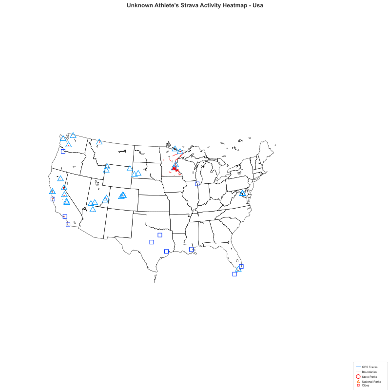
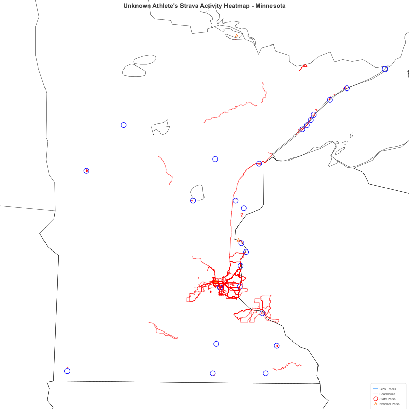
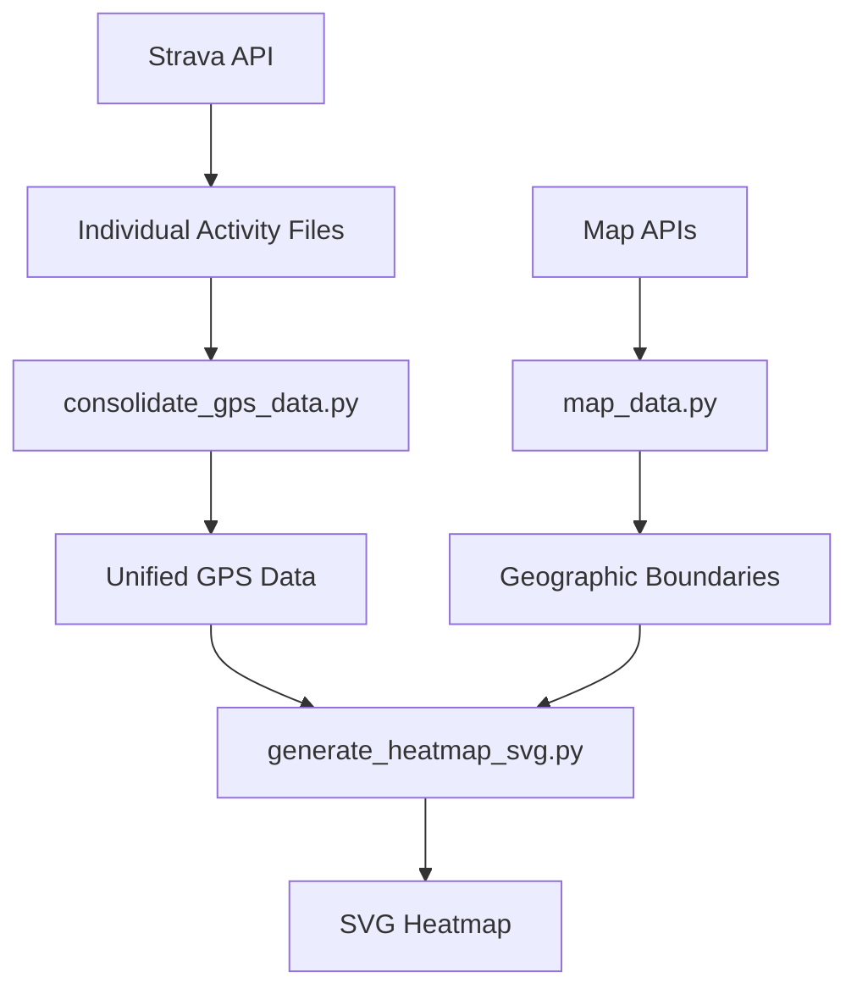

# Strava GPS Heatmap Generator

StravaのGPSデータから美しいヒートマップを生成するPythonアプリケーションです。レートリミット対応、自動トークン管理、堅牢なエラーハンドリングを備えた本格的なデータ処理ツールです。

## ✨ 主要機能

- 🔥 **高品質ヒートマップ生成**: GPS軌跡を美しいSVGヒートマップに変換
- 📐 **高精度投影法**: ミネソタ地域でUTM Zone 15N投影（距離誤差<0.04%）
- 🗺️ **詳細地理境界システム**: 多層階層境界線（国境・都道府県・州・市・湖）
- 🌏 **自動地域判定**: GPS範囲に基づく適切な境界データ自動選択
- 🎨 **設定ベーススタイリング**: 境界タイプ別の色・線幅・表示制御
- 🏞️ **ミネソタ州立公園表示**: 59の州立公園を個別制御可能な円マーカーで表示
- 🏔️ **アメリカ国立公園表示**: 79の国立公園・記念碑を△印マーカーで表示、個別制御可能
- 🏙️ **アメリカ都市表示**: 10の主要都市を□印マーカーで表示、個別制御可能
- 🔄 **自動レート制限管理**: Strava APIの制限を自動検知・回避
- 🔐 **スマート認証**: 自動トークンリフレッシュ・永続化
- 📊 **進捗レポート**: リアルタイム処理状況・統計表示
- 💾 **データ管理**: 個別アクティビティファイル・バックアップ管理
- ⚡ **高性能処理**: 大量データ対応・Ctrl-C割り込み対応
- 🎨 **完全カスタマイズ**: config.jsonベースの柔軟な設定システム

## 📸 サンプル

### アメリカ全域ヒートマップ例
アメリカ全域465アクティビティ（2,520,773 GPS点）から生成されたヒートマップ：



*アメリカ地域フィルタリング（`--region usa`）による結果*
- **データ**: 465アクティビティ、約252万GPS点
- **範囲**: 24.7°N-48.8°N, 125°W-66°W（本土48州、アラスカ・ハワイ除外）
- **投影法**: Albers Equal Area Conic投影、距離・面積の高精度保持
- **境界**: 州境界（58本）+ 湖境界（99本）+ メイン州境界含む
- **国立公園**: 79サイト中37の国立公園・記念碑を△印で表示
- **都市**: 主要10都市を□印で表示（シカゴ、マイアミ、ダラス等）
- **設定**: 1600x1600ピクセル、2.0幅GPS軌跡、1.0幅境界線

### ミネソタ州ヒートマップ例
ミネソタ州内の403アクティビティ（1,947,578 GPS点）から生成されたヒートマップ：



*ミネソタ州地域フィルタリング（`--region minnesota`）による結果*
- **データ**: 403アクティビティ、約195万GPS点
- **範囲**: 43.6°N-48.4°N, 96.2°W-90.5°W（5年間の活動記録）
- **投影法**: UTM Zone 15N（EPSG:32615）高精度投影、距離誤差<0.04%
- **境界**: 州境界（8本）+ 湖境界（15本）、市境界は非表示
- **州立公園**: 59サイト中25の州立公園を○印で表示
- **国立公園**: ミネソタ関連の国立公園・記念碑を△印で表示
- **設定**: 1600x1600ピクセル、2.0幅GPS軌跡、1.0幅境界線

**地域フィルタリング機能の例:**
- `--region japan`: 日本のみ（20アクティビティ）
- `--region usa`: アメリカ全域（465アクティビティ）
- `--region minnesota`: ミネソタ州のみ（403アクティビティ）
- `--region saint_paul_100km`: セントポール半径100km（339アクティビティ）

## 🚀 クイックスタート

### 1. セットアップ
```bash
# 仮想環境を作成・有効化
python3 -m venv venv
source venv/bin/activate

# 依存関係をインストール
pip install -r requirements.txt
```

### 2. Strava API設定
1. [Strava Developer Portal](https://developers.strava.com/)でアプリを作成
2. Client ID・Client Secretを取得
3. トークンを取得:
```bash
python get_new_token.py
```

### 3. データ処理パイプライン
```bash
# ステップ1: GPSデータをダウンロード
python download_strava_data.py

# ステップ2: ヒートマップを生成
python generate_heatmap_svg.py
```

## 📋 詳細ワークフロー

### 🔍 レート制限チェック
```bash
python check_rate_limit.py
```

### 📥 データダウンロード

#### 方法A: 統合ダウンロード（推奨）
```bash
python download_strava_data.py
```

#### 方法B: 個別アクティビティダウンロード  
```bash
python download_individual_activities.py
# その後データを統合
python consolidate_gps_data.py
```

### 🔥 ヒートマップ生成

#### 全データ（デフォルト）
```bash
source venv/bin/activate && python generate_heatmap_svg.py
```

#### 地域別フィルタリング
```bash
# 日本のみ
source venv/bin/activate && python generate_heatmap_svg.py --region japan

# アメリカのみ
source venv/bin/activate && python generate_heatmap_svg.py --region usa

# ミネソタ州のみ
source venv/bin/activate && python generate_heatmap_svg.py --region minnesota

# セントポール半径100kmのみ
source venv/bin/activate && python generate_heatmap_svg.py --region saint_paul_100km
```

## ⚙️ 設定

`config.json`で全ての設定を管理：

```json
{
  "strava": {
    "client_id": "YOUR_CLIENT_ID",
    "client_secret": "YOUR_CLIENT_SECRET",
    "access_token": "YOUR_ACCESS_TOKEN",
    "refresh_token": "YOUR_REFRESH_TOKEN"
  },
  "data": {
    "output_dir": "strava_data",
    "input_dir": "strava_data",
    "gps_data_file": "gps_data.json"
  },
  "output": {
    "filename": "strava_heatmap.svg",
    "width": 3600,
    "height": 3600
  },
  "style": {
    "background_color": "#ffffff",
    "track_color": "#ff0000",
    "track_width": "2.0",
    "track_opacity": "0.7",
    "boundary_color": "#000000",
    "boundary_width": "0.8",
    "boundary_fill": "none"
  },
  "boundaries": {
    "world": {
      "enabled": true,
      "color": "#000000",
      "width": "1.0",
      "note": "World boundaries are automatically skipped in Japan/USA regions to use detailed boundaries instead"
    },
    "japan": {
      "enabled": true,
      "prefectures": {
        "enabled": true,
        "color": "#000000",
        "width": "1.0"
      },
      "lakes": {
        "enabled": true,
        "color": "#000000",
        "width": "1.0"
      }
    },
    "usa": {
      "enabled": true,
      "states": {
        "enabled": true,
        "color": "#000000",
        "width": "1.0"
      },
      "lakes": {
        "enabled": true,
        "color": "#000000",
        "width": "1.0"
      },
      "minnesota_cities": {
        "enabled": false,
        "color": "#999999",
        "width": "0.3"
      },
      "state_parks": {
        "enabled": true,
        "color": "#0000ff",
        "fill": "none",
        "radius": 10,
        "stroke_width": 2,
        "data_file": "map_cache/minnesota_state_parks.json"
      },
      "national_parks": {
        "enabled": true,
        "color": "#0099ff",
        "fill": "none",
        "size": 24,
        "stroke_width": 2,
        "data_file": "map_cache/us_national_parks.json"
      },
      "cities": {
        "enabled": true,
        "color": "#0033ff",
        "fill": "none",
        "size": 16,
        "stroke_width": 2,
        "data_file": "map_cache/us_cities.json"
      }
    }
  },
  "minnesota_state_parks": {
    "Afton State Park": true,
    "Banning State Park": true,
    "Bear Head Lake State Park": false,
    "Blue Mounds State Park": true,
    "Cascade River State Park": true,
    "Itasca State Park": true,
    "Split Rock Lighthouse State Park": true,
    "Temperance River State Park": true,
    "Whitewater State Park": true
  },
  "us_national_parks": {
    "Acadia National Park": true,
    "Alcatraz Island": true,
    "Arches National Park": true,
    "Badlands National Park": true,
    "Boundary Waters Canoe Area": true,
    "Devils Tower National Monument": true,
    "Golden Gate National Recreation Area": true,
    "Grand Canyon National Park": true,
    "Grays Peak": true,
    "Lake Tahoe": true,
    "Lincoln Memorial": true,
    "Mt. Evans": true,
    "National Mall and Memorial Parks": true,
    "Saint Croix National Scenic Riverway": true,
    "The White House and President's Park": true,
    "Thomas Jefferson Memorial": true,
    "Torreys Peak": true,
    "Washington Monument": true,
    "Yellowstone National Park": true,
    "Yosemite National Park": true,
    "Zion National Park": true
  },
  "us_cities": {
    "Chicago": true,
    "Dallas": true,
    "Goldthwaite": true,
    "Houston": true,
    "Key West": true,
    "Miami": true,
    "Monterey": true,
    "New Orleans": true,
    "Portland": true,
    "San Diego": true
  },
  "download": {
    "max_years": 8,
    "batch_size": 50,
    "retry_attempts": 3,
    "retry_delay": 300,
    "save_progress_interval": 10
  }
}
```

### 🗺️ 境界設定の詳細

**統一されたスタイリング:**
- **全境界線**: 黒色（#000000）、1.0幅で統一
- **GPSトラック**: 赤色（#ff0000）、2.0幅で視認性向上
- **背景**: 白色（#ffffff）でクリーンな表示

**階層構造:**
- **World**: 国境・海岸線（日本・アメリカ地域では自動スキップ）
- **Japan**: 都道府県境界 + 湖境界
- **USA**: 州境界 + 湖境界
- **Minnesota Cities**: 無効化（enabled: false）

**地域フィルタリング機能:**
- **Japan**: 24°-46°N, 123°-146°E（日本列島全域）
- **USA**: 24°-49°N, 125°-66°W（本土48州、アラスカ・ハワイ除外）
- **Minnesota**: 43.5°-49.4°N, 97.2°-89.5°W（ミネソタ州境界）
- **Saint Paul 100km**: セントポール中心半径100km（Haversine距離計算）

**ミネソタ州立公園機能:**
- **59の州立公園**: 正確なGPS座標による位置表示
- **個別制御**: config.jsonで各公園の表示/非表示を設定可能
- **カスタマイズ**: 色・サイズ・線幅を設定可能な円マーカー
- **自動表示**: ミネソタ地域（`minnesota`、`saint_paul_100km`）で自動描画

**アメリカ国立公園機能:**
- **79の国立公園・記念碑**: 全アメリカ国立公園・記念碑・レクリエーションエリアの正確なGPS座標データベース
- **△印マーカー**: 識別しやすい三角形マーカーで表示
- **個別制御**: config.jsonで各国立公園の表示/非表示を設定可能
- **カスタマイズ**: 色・サイズ・線幅を完全制御（デフォルト：ライトブルー）
- **自動表示**: アメリカ地域（`usa`、`all`）で自動描画

**アメリカ都市機能:**
- **10の主要都市**: アメリカの代表的な都市の正確なGPS座標データベース
- **□印マーカー**: 識別しやすい正方形マーカーで表示
- **個別制御**: config.jsonで各都市の表示/非表示を設定可能
- **カスタマイズ**: 色・サイズ・線幅を完全制御（デフォルト：ダークブルー）
- **自動表示**: アメリカ地域（`usa`、`all`）で自動描画

**自動地域判定:**
- GPS範囲に基づいて適切な境界データを自動選択
- 地域フィルタリング時は不要な境界データをスキップしてパフォーマンス向上

## 🏗️ アーキテクチャ

### 📂 プロジェクト構造

```
📂 heat-map/
├── 🚀 **メインスクリプト**
│   ├── download_strava_data.py          # メインダウンロード
│   ├── download_individual_activities.py # 個別アクティビティダウンロード  
│   ├── consolidate_gps_data.py          # データ統合
│   └── generate_heatmap_svg.py          # ヒートマップ生成
├── 🔧 **Stravaユーティリティ**
│   ├── strava_config.py                 # 設定管理
│   ├── strava_auth.py                   # 認証・レート制限
│   ├── strava_files.py                  # ファイル操作
│   ├── strava_progress.py               # 進捗レポート
│   └── strava_utils.py                  # 共通ユーティリティ
├── 🗺️ **ヒートマップコア**
│   ├── heatmap_generator.py             # ヒートマップアルゴリズム
│   ├── heatmap_utils.py                 # ヒートマップユーティリティ
│   ├── map_data.py                      # 多層階層地理データ取得・管理
│   └── svg_renderer.py                  # SVGレンダリング
├── 🔗 **Strava統合**
│   └── strava_client.py                 # Strava APIクライアント
├── 🛠️ **サポートツール**
│   ├── background_download.py           # バックグラウンドダウンロード
│   ├── check_rate_limit.py              # レート制限チェック
│   └── get_new_token.py                 # OAuthトークン取得
└── ⚙️ **設定**
    ├── config.json                      # 設定ファイル
    └── .gitignore                       # Git無視設定
```

### 🔧 コアモジュール

#### **Stravaユーティリティ**
- **`strava_config.py`**: 設定管理の中央化（デフォルト生成・検証・型安全）
- **`strava_auth.py`**: 認証・レート制限の統合管理
- **`strava_files.py`**: ファイル操作の標準化（timestamp・latest・バックアップ）
- **`strava_progress.py`**: 統一された進捗レポート・統計表示
- **`strava_utils.py`**: 共通ヘルパー関数・データ検証

#### **ヒートマップエンジン**
- **`heatmap_generator.py`**: Bresenhamアルゴリズムによるヒートマップ生成
- **`heatmap_utils.py`**: GPS検証・境界計算・パフォーマンス推定
- **`map_data.py`**: 多層階層地理データ管理（国境・都道府県・州・市・湖）
- **`svg_renderer.py`**: 正距円筒図法による設定ベースSVGレンダリング

#### **Strava統合**
- **`strava_client.py`**: Strava API統合（自動トークン管理・レート制限）

## 📁 データ管理

### ファイル命名規則

#### **個別アクティビティ**
```
activity_YYYYMMDD_ID_activityname.json
例: activity_20250629_14957284575_ランチタイム_ライド.json
```

#### **統合データ**
```
gps_data_YYYYMMDD_HHMMSS.json       # タイムスタンプ付きバックアップ
gps_data_latest.json                # 最新データ（自動生成）
athlete_info_latest.json            # アスリート情報
```

#### **出力ファイル**
```
strava_heatmap.svg                  # 生成されたヒートマップ
strava_heatmap_minnesota.svg        # ミネソタ地域ヒートマップ
strava_heatmap_usa.svg              # アメリカ地域ヒートマップ（国立公園・都市付き）
map_cache/                          # 地理境界データキャッシュ
map_cache/minnesota_state_parks.json  # ミネソタ州立公園座標データ
map_cache/us_national_parks.json    # アメリカ国立公園座標データ
map_cache/us_cities.json            # アメリカ主要都市座標データ
```

### データフロー



## 📊 パフォーマンス

### 処理能力
- **アクティビティ**: 数千件の処理に対応
- **GPS点**: 数十万点のリアルタイム処理
- **メモリ効率**: ストリーミング処理でメモリ使用量最適化
- **割り込み対応**: Ctrl-C による安全な中断・レジューム機能

### 最適化機能
- **自動解像度調整**: データ密度に基づく最適グリッドサイズ
- **処理時間推定**: 実行前の処理時間予測
- **プログレッシブ表示**: リアルタイム進捗・ETA表示
- **エラー回復**: 堅牢なエラーハンドリング・自動リトライ

## 🔧 高度な使用方法

### バックグラウンドダウンロード
```bash
# 長時間実行・レジューム対応
python background_download.py
```

### カスタム設定例

#### 高解像度ヒートマップ
```json
{
  "output": {
    "width": 24000,
    "height": 16000
  }
}
```

#### カスタムカラースキーム
```json
{
  "style": {
    "background_color": "#f0f8ff",
    "track_color": "#ff6b35",
    "track_width": "2.0",
    "track_opacity": "0.8"
  }
}
```

#### 境界表示カスタマイズ
```json
{
  "boundaries": {
    "world": {
      "enabled": true,
      "color": "#2c3e50",
      "width": "1.2"
    },
    "japan": {
      "prefectures": {
        "enabled": false
      }
    },
    "usa": {
      "states": {
        "color": "#34495e",
        "width": "0.8"
      },
      "minnesota_cities": {
        "enabled": false
      }
    }
  }
}
```

## 🚨 制限と注意事項

### API制限
- **レートリミット**: 15分間100リクエスト、1日1000リクエスト
- **自動対応**: アプリが制限を自動検知・待機・継続
- **トークン管理**: 自動更新・永続化（手動介入不要）

### データプライバシー
- **ローカル保存**: 全データがローカルに安全保存
- **API秘密鍵**: `.gitignore`で自動除外
- **選択的共有**: 必要なファイルのみをバージョン管理

### システム要件
- **Python**: 3.8+ （3.9.6・3.12で検証済み）
- **依存関係**: requests>=2.25.0, numpy>=1.21.0, pyproj>=3.0.0
- **ディスク**: GPS データサイズに応じて（通常1-10MB）

### 🆕 新機能：多投影法システム（2025-07-07）
- **UTM Zone 15N**: ミネソタ・セントポール地域で高精度投影（距離誤差<0.04%）
- **Albers Equal Area Conic**: アメリカ全域で距離・面積の正確保持、ひずみ最小化
- **Equirectangular**: 日本・その他地域でのバランス投影
- **自動選択**: 地域に応じた最適投影の自動適用

## 🔍 トラブルシューティング

### 認証問題
```bash
# 新しいトークンを取得
python get_new_token.py

# レート制限状況を確認
python check_rate_limit.py
```

### データ問題
```bash
# データを再統合
python consolidate_gps_data.py

# 破損ファイルをスキップして処理続行
# （アプリが自動的に処理）
```

### パフォーマンス問題
```bash
# バックグラウンド処理でメモリ使用量削減
python background_download.py

# 個別ダウンロードで段階的処理
python download_individual_activities.py
```

## 🏆 成果事例

- ✅ **大規模データ処理**: 485アクティビティ、2,613,174 GPS点の処理実績
- ✅ **広域地理的カバレッジ**: 日本〜アメリカ全域（24.7°N-48.8°N, 123.9°W-135.7°E）
- ✅ **多様なアクティビティ**: サイクリング、ハイキング、ランニング、ノルディックスキー、マウンテンバイク等
- ✅ **地域別フィルタリング**: 日本（20活動）、アメリカ（465活動）、ミネソタ州（403活動）、セントポール100km（339活動）
- ✅ **統一されたビジュアルデザイン**: 3600x3600ピクセル、2.0幅GPS軌跡、1.0幅境界線で一貫性のある表示
- ✅ **プロダクション品質**: エラーハンドリング、レート制限、データ検証、設定ベース制御すべて対応

## 🔄 最近の改善

### 2025-07-01: 大規模リファクタリング
- **950+行のコード重複削除**: 設定・認証・ファイル操作・進捗レポートの中央化
- **47%のコード削減**: メインスクリプトの簡素化・保守性向上
- **統一されたエラーハンドリング**: 全スクリプトでの一貫したエラー処理
- **向上したCtrl-C対応**: 1秒以内の応答性・安全な中断処理

### 2025-07-02: 地域フィルタリング機能追加
- **コマンドライン地域フィルタリング**: `--region japan|usa|minnesota|saint_paul_100km`
- **Haversine距離計算**: セントポール半径100km精密フィルタリング
- **自動境界最適化**: 地域に応じた不要境界データスキップ
- **統一ビジュアルデザイン**: 3600x3600ピクセル、太GPS軌跡（2.0）、統一境界線（1.0）

### 2025-07-07: ミネソタ州立公園機能追加
- **59の州立公園データベース**: 正確なGPS座標による位置データ
- **個別表示制御**: config.jsonで各公園の表示/非表示を個別設定
- **カスタマイズ可能なスタイル**: 色・サイズ・線幅の完全制御
- **自動描画**: ミネソタ地域フィルタリング時に自動表示

### 2025-07-07: アメリカ国立公園機能追加
- **79の国立公園データベース**: 全アメリカ国立公園・記念碑の完全なGPS座標データ
- **△印マーカー表示**: 識別しやすい三角形マーカーでの可視化
- **個別公園制御**: config.jsonで各国立公園の表示/非表示を個別設定
- **カスタマイズ可能スタイル**: 色・サイズ・線幅の完全制御（ライトブルーデフォルト）
- **自動描画**: アメリカ地域（`usa`、`all`、`minnesota`、`saint_paul_100km`）で自動表示
- **追加サイト**: 国立記念碑、国立レクリエーションエリア、ワシントンD.C.記念施設含む

### 2025-07-08: アメリカ都市表示機能追加
- **10都市データベース**: アメリカ主要都市の正確なGPS座標データ
- **□印マーカー表示**: 識別しやすい正方形マーカーでの可視化
- **個別都市制御**: config.jsonで各都市の表示/非表示を個別設定
- **カスタマイズ可能スタイル**: 色・サイズ・線幅の完全制御（ダークブルーデフォルト）
- **自動描画**: アメリカ地域（`usa`、`all`）で自動表示
- **主要都市**: キーウェスト、マイアミ、ダラス、ヒューストン、シカゴ、ポートランド等

### 2025-07-08: メイン州境界問題修正
- **東海岸範囲拡張**: GPS範囲を-66°まで拡張してメイン州境界を含む
- **アラスカ・ハワイ除外**: 本土48州のみに範囲を限定（24°-49°N, 125°-66°W）
- **境界データ最適化**: 不要な遠隔地域データを除外してパフォーマンス向上
- **完全な州境界表示**: 全48州の境界線が正確に描画される保証

### 2025-07-07: 多投影法システム実装
- **Albers Equal Area Conic投影**: アメリカ全域でのひずみ最小化・高精度表示
- **描画範囲拡大**: アメリカ東海岸の完全カバレッジ（-66°から-60°へ拡張）
- **投影自動選択**: 地域に応じた最適投影の自動適用
- **視覚品質向上**: 各地域で最も適切な投影法による正確な地理表現

### 継続的な機能強化
- **GPS データ検証**: 完全性チェック・破損データ検出
- **処理時間推定**: 実行前の時間・リソース予測  
- **地理的サマリー**: 自動的な範囲・密度分析
- **向上した進捗表示**: ETA・統計・パフォーマンス指標

## 📄 ライセンス

このプロジェクトはMITライセンスの下で公開されています。