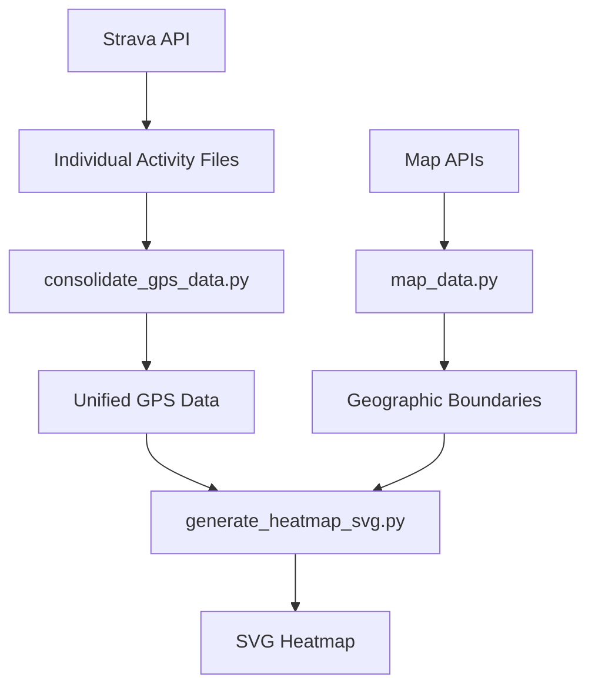

# Strava GPS Heatmap Generator

StravaのGPSデータから美しいヒートマップを生成するPythonアプリケーションです。レートリミット対応、自動トークン管理、堅牢なエラーハンドリングを備えた本格的なデータ処理ツールです。

## ✨ 主要機能

- 🔥 **高品質ヒートマップ生成**: GPS軌跡を美しいSVGヒートマップに変換
- 🌍 **地理境界線表示**: 国境・州境界を自動取得・表示
- 🔄 **自動レート制限管理**: Strava APIの制限を自動検知・回避
- 🔐 **スマート認証**: 自動トークンリフレッシュ・永続化
- 📊 **進捗レポート**: リアルタイム処理状況・統計表示
- 💾 **データ管理**: 個別アクティビティファイル・バックアップ管理
- ⚡ **高性能処理**: 大量データ対応・Ctrl-C割り込み対応
- 🎨 **カスタマイズ可能**: 色・サイズ・スタイル設定

## 🚀 クイックスタート

### 1. セットアップ
```bash
# 仮想環境を作成・有効化
python3 -m venv venv
source venv/bin/activate

# 依存関係をインストール
pip install -r requirements.txt
```

### 2. Strava API設定
1. [Strava Developer Portal](https://developers.strava.com/)でアプリを作成
2. Client ID・Client Secretを取得
3. トークンを取得:
```bash
python get_new_token.py
```

### 3. データ処理パイプライン
```bash
# ステップ1: GPSデータをダウンロード
python download_strava_data.py

# ステップ2: ヒートマップを生成
python generate_heatmap_svg.py
```

## 📋 詳細ワークフロー

### 🔍 レート制限チェック
```bash
python check_rate_limit.py
```

### 📥 データダウンロード

#### 方法A: 統合ダウンロード（推奨）
```bash
python download_strava_data.py
```

#### 方法B: 個別アクティビティダウンロード  
```bash
python download_individual_activities.py
# その後データを統合
python consolidate_gps_data.py
```

### 🔥 ヒートマップ生成
```bash
python generate_heatmap_svg.py
```

## ⚙️ 設定

`config.json`で全ての設定を管理：

```json
{
  "strava": {
    "client_id": "YOUR_CLIENT_ID",
    "client_secret": "YOUR_CLIENT_SECRET",
    "access_token": "YOUR_ACCESS_TOKEN",
    "refresh_token": "YOUR_REFRESH_TOKEN"
  },
  "data": {
    "output_dir": "strava_data",
    "gps_data_file": "gps_data.json"
  },
  "output": {
    "filename": "strava_heatmap.svg",
    "width": 1200,
    "height": 800
  },
  "style": {
    "track_color": "#dc3545",
    "track_width": "1.5",
    "boundary_color": "#dee2e6",
    "boundary_width": "0.5"
  },
  "download": {
    "max_years": 8,
    "batch_size": 50,
    "retry_attempts": 3,
    "retry_delay": 300,
    "save_progress_interval": 10
  }
}
```

## 🏗️ アーキテクチャ

### 📂 プロジェクト構造

```
📂 heat-map/
├── 🚀 **メインスクリプト**
│   ├── download_strava_data.py          # メインダウンロード
│   ├── download_individual_activities.py # 個別アクティビティダウンロード  
│   ├── consolidate_gps_data.py          # データ統合
│   └── generate_heatmap_svg.py          # ヒートマップ生成
├── 🔧 **Stravaユーティリティ**
│   ├── strava_config.py                 # 設定管理
│   ├── strava_auth.py                   # 認証・レート制限
│   ├── strava_files.py                  # ファイル操作
│   ├── strava_progress.py               # 進捗レポート
│   └── strava_utils.py                  # 共通ユーティリティ
├── 🗺️ **ヒートマップコア**
│   ├── heatmap_generator.py             # ヒートマップアルゴリズム
│   ├── heatmap_utils.py                 # ヒートマップユーティリティ
│   ├── map_data.py                      # 地理データ取得
│   └── svg_renderer.py                  # SVGレンダリング
├── 🔗 **Strava統合**
│   └── strava_client.py                 # Strava APIクライアント
├── 🛠️ **サポートツール**
│   ├── background_download.py           # バックグラウンドダウンロード
│   ├── check_rate_limit.py              # レート制限チェック
│   └── get_new_token.py                 # OAuthトークン取得
└── ⚙️ **設定**
    ├── config.json                      # 設定ファイル
    └── .gitignore                       # Git無視設定
```

### 🔧 コアモジュール

#### **Stravaユーティリティ**
- **`strava_config.py`**: 設定管理の中央化（デフォルト生成・検証・型安全）
- **`strava_auth.py`**: 認証・レート制限の統合管理
- **`strava_files.py`**: ファイル操作の標準化（timestamp・latest・バックアップ）
- **`strava_progress.py`**: 統一された進捗レポート・統計表示
- **`strava_utils.py`**: 共通ヘルパー関数・データ検証

#### **ヒートマップエンジン**
- **`heatmap_generator.py`**: Bresenhamアルゴリズムによるヒートマップ生成
- **`heatmap_utils.py`**: GPS検証・境界計算・パフォーマンス推定
- **`map_data.py`**: 地理境界データのダウンロード・キャッシュ管理
- **`svg_renderer.py`**: 正距円筒図法によるSVGレンダリング

#### **Strava統合**
- **`strava_client.py`**: Strava API統合（自動トークン管理・レート制限）

## 📁 データ管理

### ファイル命名規則

#### **個別アクティビティ**
```
activity_YYYYMMDD_ID_activityname.json
例: activity_20250629_14957284575_ランチタイム_ライド.json
```

#### **統合データ**
```
gps_data_YYYYMMDD_HHMMSS.json       # タイムスタンプ付きバックアップ
gps_data_latest.json                # 最新データ（自動生成）
athlete_info_latest.json            # アスリート情報
```

#### **出力ファイル**
```
strava_heatmap.svg                  # 生成されたヒートマップ
map_cache/                          # 地理境界データキャッシュ
```

### データフロー



## 📊 パフォーマンス

### 処理能力
- **アクティビティ**: 数千件の処理に対応
- **GPS点**: 数十万点のリアルタイム処理
- **メモリ効率**: ストリーミング処理でメモリ使用量最適化
- **割り込み対応**: Ctrl-C による安全な中断・レジューム機能

### 最適化機能
- **自動解像度調整**: データ密度に基づく最適グリッドサイズ
- **処理時間推定**: 実行前の処理時間予測
- **プログレッシブ表示**: リアルタイム進捗・ETA表示
- **エラー回復**: 堅牢なエラーハンドリング・自動リトライ

## 🔧 高度な使用方法

### バックグラウンドダウンロード
```bash
# 長時間実行・レジューム対応
python background_download.py
```

### カスタム設定例

#### 高解像度ヒートマップ
```json
{
  "output": {
    "width": 2400,
    "height": 1600
  }
}
```

#### カスタムカラースキーム
```json
{
  "style": {
    "track_color": "#ff6b35",
    "track_width": "2.0",
    "boundary_color": "#2c3e50",
    "boundary_width": "0.8"
  }
}
```

## 🚨 制限と注意事項

### API制限
- **レートリミット**: 15分間100リクエスト、1日1000リクエスト
- **自動対応**: アプリが制限を自動検知・待機・継続
- **トークン管理**: 自動更新・永続化（手動介入不要）

### データプライバシー
- **ローカル保存**: 全データがローカルに安全保存
- **API秘密鍵**: `.gitignore`で自動除外
- **選択的共有**: 必要なファイルのみをバージョン管理

### システム要件
- **Python**: 3.8+ （3.9.6・3.12で検証済み）
- **依存関係**: requests>=2.25.0, numpy>=1.21.0
- **ディスク**: GPS データサイズに応じて（通常1-10MB）

## 🔍 トラブルシューティング

### 認証問題
```bash
# 新しいトークンを取得
python get_new_token.py

# レート制限状況を確認
python check_rate_limit.py
```

### データ問題
```bash
# データを再統合
python consolidate_gps_data.py

# 破損ファイルをスキップして処理続行
# （アプリが自動的に処理）
```

### パフォーマンス問題
```bash
# バックグラウンド処理でメモリ使用量削減
python background_download.py

# 個別ダウンロードで段階的処理
python download_individual_activities.py
```

## 🏆 成果事例

- ✅ **8年間のStravaデータ**: 93アクティビティ、552,019 GPS点の処理実績
- ✅ **地理的カバレッジ**: 北米西部〜中西部（36.6°N-47.7°N, 122.5°W-90.5°W）
- ✅ **アクティビティタイプ**: サイクリング、ハイキング、ランニング、スキー、マウンテンバイク
- ✅ **プロダクション品質**: エラーハンドリング、レート制限、データ検証すべて対応

## 🔄 最近の改善 (2025-07-01)

### リファクタリング成果
- **950+行のコード重複削除**: 設定・認証・ファイル操作・進捗レポートの中央化
- **47%のコード削減**: メインスクリプトの簡素化・保守性向上
- **統一されたエラーハンドリング**: 全スクリプトでの一貫したエラー処理
- **向上したCtrl-C対応**: 1秒以内の応答性・安全な中断処理

### 新機能
- **GPS データ検証**: 完全性チェック・破損データ検出
- **処理時間推定**: 実行前の時間・リソース予測  
- **地理的サマリー**: 自動的な範囲・密度分析
- **向上した進捗表示**: ETA・統計・パフォーマンス指標

## 📄 ライセンス

このプロジェクトはMITライセンスの下で公開されています。